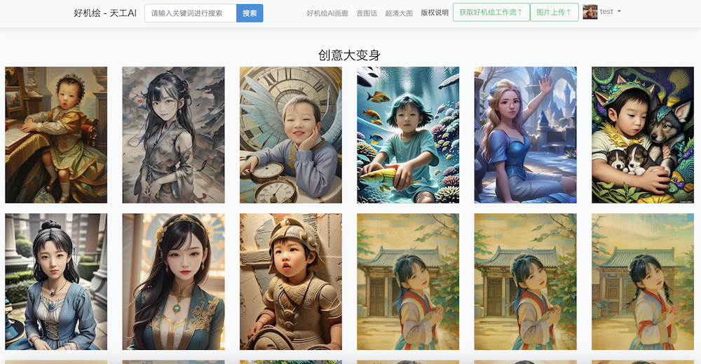
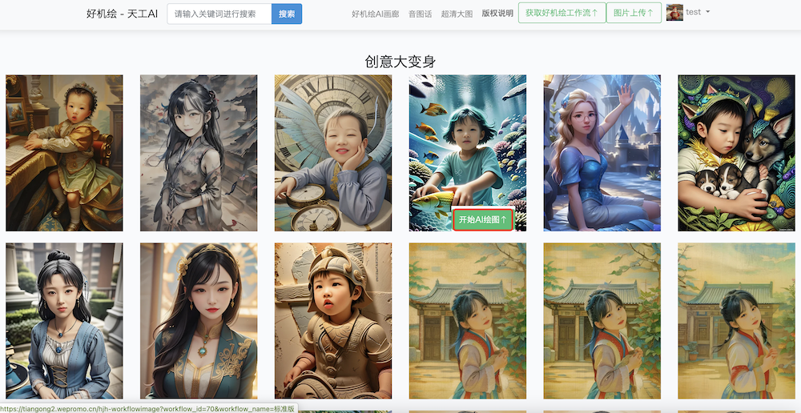
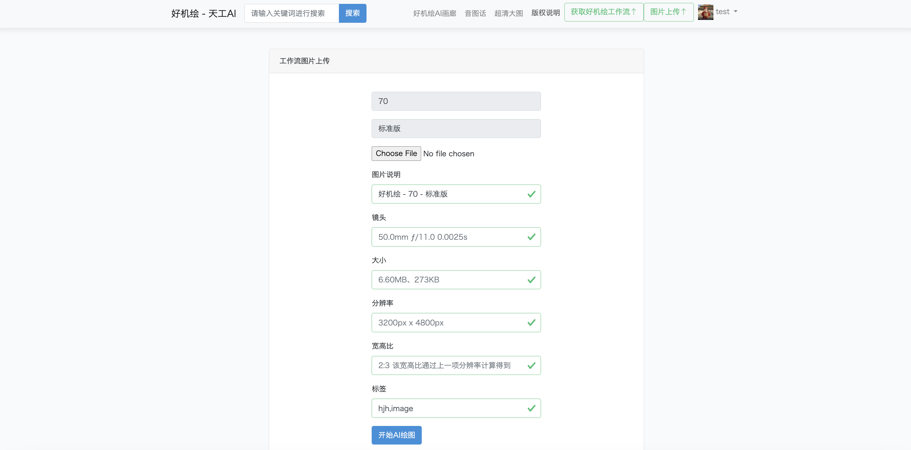
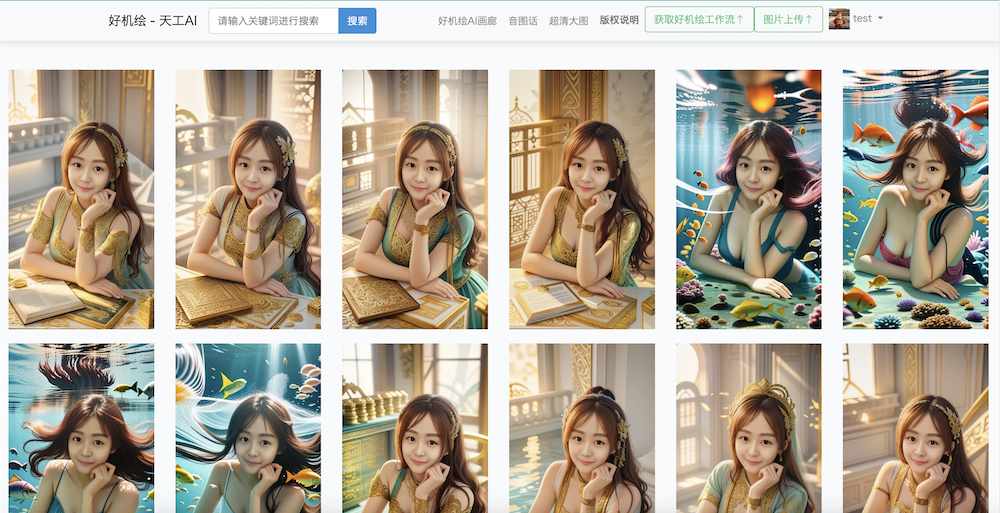

# hjh-ai-demo

好机绘AIGC云服务示例，选择玩法，上传人脸图像完成AI绘图，AI绘图主要玩法包括创意大变身、主角梦想秀，本项目调用了好机绘AIGC云服务接口

## 好机绘AIGC云服务接口文档

[接口文档](https://cloud.wepromo.cn/openapi/index.html)

## 主要接口

* 获取Token
* 获取工作流
* AI绘图
* 查询AI绘图结果

## callback data
```json
{
	"task_no": "1202505281502238471504",
	"data": {
        "code": 200,
        "message": "ok",
        "data": {
		    "task_status": 3,
		    "images": [],
		    "source": [],
		    "faceswap": []
        }
	}
}
```

## 主要功能

### 1. 工作流列表



### 2. 选择工作流



### 3. 上传人脸图像，开始AI绘图



### 4. AI画廊



## 好机绘文博

[观看视频](https://ai.wepromo.cn/images/announcement_image/844a870837301c4395bf1bb5a970fffa1741663274.mp4)

## 联系我们


[联系邮箱](mailto:xitongtongzhi@ai-space.net)